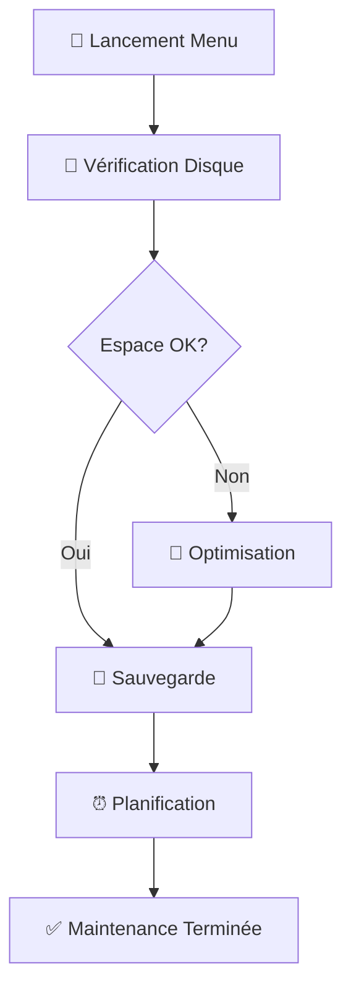

<div align="center">

# 🚀 Projet Bash Final
## Suite d'Administration Système

[](https://streamable.com/lf027o)
[](LICENSE)
[](https://www.gnu.org/software/bash/)
[](https://streamable.com/lf027o)

*Une collection complète de scripts Bash pour l'administration système*

---

</div>

## 📋 À Propos du Projet

> **Une suite d'outils puissante et intuitive pour l'administration système Linux**

Cette collection de scripts Bash offre une interface utilisateur interactive et des fonctionnalités avancées pour gérer efficacement votre environnement Linux. Développée par une équipe passionnée, elle combine simplicité d'utilisation et fonctionnalités professionnelles.

<div align="center">

### 👥 Équipe de Développement

| Développeur | Rôle | Spécialité |
|-------------|------|------------|
| **Jimmy** | Dev | Architecture & Interface |
| **Sameer** | Dev | Sécurité & Performance |
| **Alexandre** | Dev | Automatisation & Déploiement |

</div>

---

## 🎯 Fonctionnalités Principales

<div align="center">

### 🔧 Scripts Disponibles (Version 1.29)

</div>

<table>
<tr>
<td width="50%">

#### 🔐 **Sécurité & Monitoring**
- 🔍 **analysSSH.sh** - Surveillance SSH
- 📊 **analyse_log.sh** - Analyse de logs
- 🌐 **test_reseaux.sh** - Diagnostic réseau
- 📈 **rapport_sys.sh** - Rapports système

</td>
<td width="50%">

#### ⚡ **Optimisation & Maintenance**
- 🧹 **cleanFiles.sh** - Nettoyage système
- ⚡ **optimisation.sh** - Optimisation avancée
- 💾 **disque.sh** - Surveillance disque
- 📦 **majPackages.sh** - Gestion packages

</td>
</tr>
<tr>
<td width="50%">

#### 💾 **Sauvegarde & Synchronisation**
- 💾 **sauvegarde.sh** - Sauvegarde automatisée
- 🔄 **synch_repertoire.sh** - Synchronisation
- ⏰ **planificateur.sh** - Tâches programmées

</td>
<td width="50%">

#### 🛠️ **Outils de Développement**
- 📝 **templateGenerator.sh** - Générateur de templates
- 🎮 **Menu Principal** - Interface interactive
- ❓ **Aide Intégrée** - Documentation complète

</td>
</tr>
</table>

---

## 🚀 Démarrage Rapide

### 📦 Installation

```bash
# 1. Cloner le projet
git clone https://streamable.com/lf027o
cd projet-bash-final

# 2. Permissions
chmod +x dossier_arbo/*.sh
chmod +x menu_principal.sh

# 3. Lancement
./menu_principal.sh
```

<div align="center">

### 🎮 Interface du Menu Principal


*Interface colorée avec navigation intuitive et aide contextuelle*

</div>

---

## 📖 Documentation Détaillée

<details>
<summary><strong>💾 Script de Sauvegarde</strong></summary>

### 🔧 Fonctionnalités
- ✅ Sauvegarde automatisée avec horodatage
- ✅ Compression tar.gz optimisée
- ✅ Configuration personnalisable

### ⚙️ Configuration
```bash
SOURCE="/home/jimmy/cours_expernet"  # Répertoire source
DEST_LOCAL="/tmp"                    # Destination
```

### 🚀 Utilisation
```bash
./sauvegarde.sh
# Génère : sauvegarde_2024-01-15_14-30-22.tar.gz
```

</details>

<details>
<summary><strong>⏰ Planificateur de Tâches</strong></summary>

### 🔧 Fonctionnalités
- ✅ Interface cron simplifiée
- ✅ Fréquences prédéfinies
- ✅ Expressions personnalisées
- ✅ Gestion complète du crontab

### 📅 Options Disponibles
| Fréquence | Description | Expression Cron |
|-----------|-------------|-----------------|
| 🕐 Minutes | Toutes les minutes | `* * * * *` |
| 🕑 Heures | Toutes les heures | `0 * * * *` |
| 📅 Quotidien | Tous les jours | `0 0 * * *` |
| 📆 Hebdomadaire | Tous les lundis | `0 0 * * 1` |
| 🗓️ Mensuel | Tous les mois | `0 0 1 * *` |

</details>

<details>
<summary><strong>⚡ Optimisation Système</strong></summary>

### 🔧 Fonctionnalités
- ✅ Nettoyage intelligent multi-zones
- ✅ Détection automatique des outils
- ✅ Suppression sécurisée des doublons

### 🧹 Zones de Nettoyage
```bash
/tmp/* /var/tmp/*     # Fichiers temporaires
APT Cache             # Cache des packages
NPM Cache            # Cache Node.js (si installé)
*.pyc                # Python compilés
```

</details>

<details>
<summary><strong>💾 Surveillance Disque</strong></summary>

### 🔧 Fonctionnalités
- ✅ Monitoring temps réel
- ✅ Alertes configurables
- ✅ Notifications système
- ✅ Support email (SMTP)

### ⚙️ Configuration
```bash
SEUIL=20          # Seuil d'alerte (%)
PARTITION="/"     # Partition surveillée
```

</details>

---

## 🎯 Exemples d'Utilisation

<div align="center">

### 🔄 Workflow Automatisé Recommandé

</div>



### 📋 Séquence Type de Maintenance

```bash
# 1. Vérification de l'espace disque
./menu_principal.sh → Option 4 (disque.sh)

# 2. Optimisation si nécessaire  
./menu_principal.sh → Option 6 (optimisation.sh)

# 3. Sauvegarde des données importantes
./menu_principal.sh → Option 9 (sauvegarde.sh)

# 4. Planification des tâches futures
./menu_principal.sh → Option 7 (planificateur.sh)
```

---

## 🛠️ Configuration Avancée

<div align="center">

### ⚙️ Personnalisation des Scripts

</div>

<table>
<tr>
<td width="50%">

#### 📁 **Chemins Personnalisés**
```bash
# menu_principal.sh
SCRIPT_DIR="/votre/chemin/scripts"

# sauvegarde.sh  
SOURCE="/votre/repertoire"
DEST_LOCAL="/votre/destination"
```

</td>
<td width="50%">

#### 🔧 **Seuils et Paramètres**
```bash
# disque.sh
SEUIL=85  # Seuil d'alerte disque

# optimisation.sh
# Personnaliser les zones de nettoyage
```

</td>
</tr>
</table>

### 🔐 Permissions et Sécurité

| Script | Permissions | Remarques |
|--------|-------------|-----------|
| `optimisation.sh` | `sudo` | Nettoyage système |
| `disque.sh` | `sudo` (notifications) | Alertes système |
| `sauvegarde.sh` | `user` | Répertoire utilisateur |
| `planificateur.sh` | `user` | Crontab utilisateur |

---

## 📊 Monitoring et Logs

<div align="center">

### 📈 Surveillance des Performances

</div>

```bash
# 📋 Vérification des tâches cron
crontab -l

# 📊 Monitoring en temps réel
tail -f /var/log/cron.log

# 💾 Logs de sauvegarde
ls -la /tmp/sauvegarde_*.tar.gz
```

### 📁 Emplacements des Logs

| Type | Emplacement | Description |
|------|-------------|-------------|
| 🕐 **Cron** | `/var/log/cron.log` | Tâches planifiées |
| 💾 **Sauvegarde** | `/tmp/sauvegarde_*.log` | Logs de sauvegarde |
| 🔍 **Système** | `/var/log/syslog` | Logs système généraux |

---

## 🆘 Dépannage

<details>
<summary><strong>🔧 Problèmes Courants</strong></summary>

### ❌ Permissions Insuffisantes
```bash
chmod +x *.sh
sudo chown $USER:$USER *.sh
```

### 📁 Répertoire Introuvable
```bash
ls -la /home/jimmy/projet_bash_final/Projet-Bash/dossier_arbo/
# Vérifier et ajuster les chemins
```

### ⏰ Crontab Non Accessible
```bash
sudo apt-get install cron
sudo systemctl enable cron
sudo systemctl start cron
```

</details>

---

## 🔄 Mises à Jour

<div align="center">

### 📋 Historique des Versions

</div>

| Version | Date | Nouveautés |
|---------|------|------------|
| **1.29** | 2024-01 | Menu interactif complet, aide intégrée |
| **1.2x** | 2023-12 | Sauvegarde automatisée, planificateur |
| **1.1x** | 2023-11 | Scripts de base, optimisation système |

### 🆙 Mise à Jour

```bash
git pull origin main
chmod +x *.sh
./menu_principal.sh
```

---

## 🤝 Support & Contribution

<div align="center">

### 💬 Besoin d'Aide ?

[](https://streamable.com/lf027o)
[](https://streamable.com/lf027o)
[](https://streamable.com/lf027o)

</div>

### 🐛 Signaler un Bug

1. 📝 **Créer une issue** sur GitHub
2. 📋 **Inclure les logs** d'erreur
3. 🖥️ **Spécifier l'environnement** système
4. 🔍 **Décrire les étapes** de reproduction

### 🎯 Contribuer au Projet

```bash
# 1. Fork du projet
git fork https://streamable.com/lf027o

# 2. Créer une branche
git checkout -b feature/nouvelle-fonctionnalite

# 3. Commit et push
git commit -m "Ajout: nouvelle fonctionnalité"
git push origin feature/nouvelle-fonctionnalite

# 4. Créer une Pull Request
```

---

<div align="center">

## 📄 Licence

Ce projet est sous licence MIT - voir le fichier [LICENSE](LICENSE) pour plus de détails.

---

### 🌟 Vous Aimez ce Projet ?

**Donnez-lui une étoile !** ⭐

[](https://streamable.com/lf027o)
[](https://streamable.com/lf027o)

---

**Développé avec ❤️ pour la communauté Open Source**

*Jimmy • Sameer • Alexandre*

[](https://www.gnu.org/software/bash/)
[](https://www.linux.org/)

</div>
